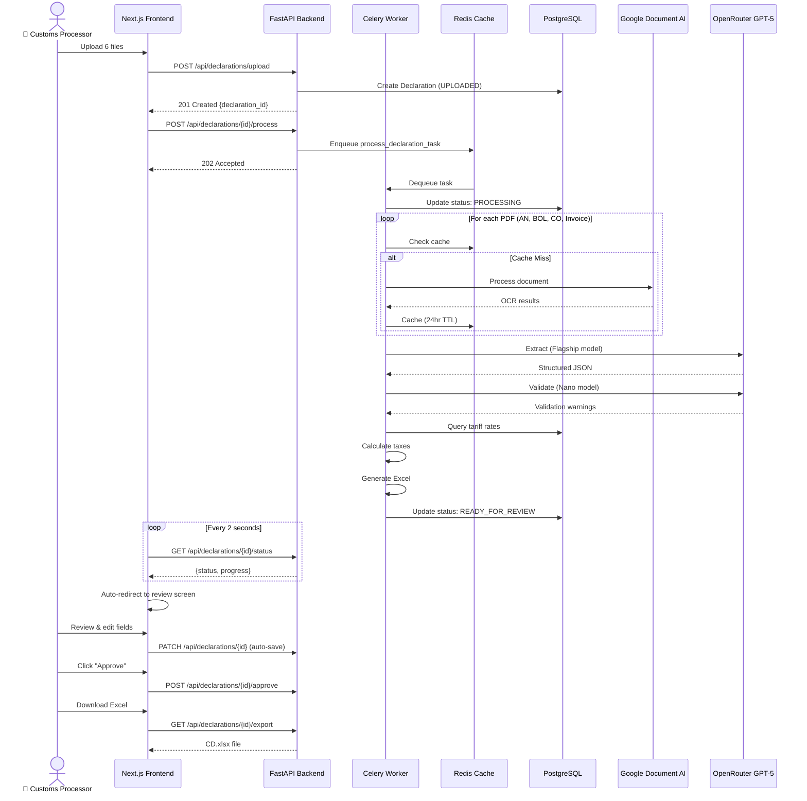
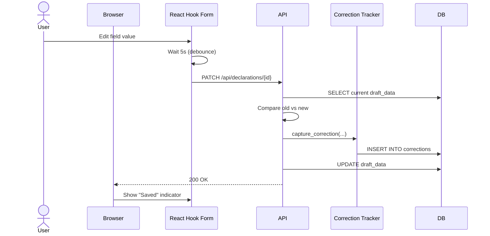

# Core Workflows

## Workflow 1: Complete Declaration Processing (Happy Path)

**Timing Breakdown (Target <90s):**
- Upload: 5-10s
- OCR (4 PDFs): 20-30s
- LLM Extraction: 25-40s
- Validation: 5-10s
- Excel Generation: 3-5s
- **Total**: 58-95s (avg 75s)

---

## Workflow 2: Auto-Save with Correction Tracking

This workflow shows automatic capture of user corrections for learning.

---
