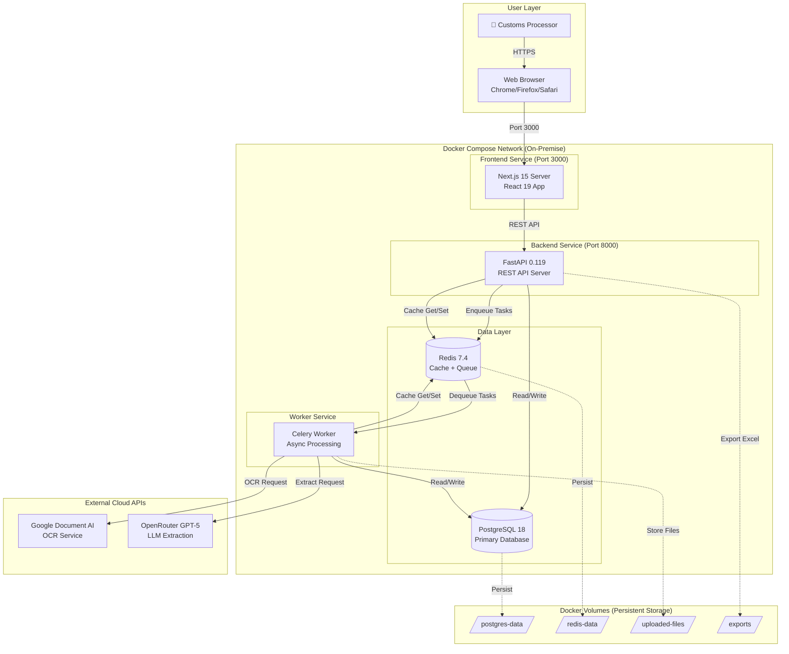

# High Level Architecture

## Technical Summary

The Customs Declaration Automation Platform employs a **pragmatic monolithic architecture** with strategic cloud AI integration, deployed as a containerized on-premise solution. The system follows a **hybrid processing model**: a Next.js 15 frontend provides the human-in-the-loop review interface, while a FastAPI backend orchestrates asynchronous document processing through Celery workers that integrate with Google Document AI (OCR) and GPT-5 (extraction/validation).

The architecture prioritizes **cost efficiency** through smart model routing (GPT-5 Flagship for complex extraction, Mini for simple fields, Nano for validation) and **data sovereignty** through complete on-premise deployment with all data persisted in Docker volumes. PostgreSQL 18 serves as the primary database for structured data, while Redis 7.4 provides both message brokering for Celery and aggressive caching for expensive OCR results.

The frontend and backend communicate via RESTful APIs with JWT authentication, enabling the side-by-side PDF verification workflow that is central to the user experience. This architecture achieves the PRD's aggressive goals: <90 second processing time per declaration, <$0.05 API cost per declaration, and 95%+ extraction accuracy through continuous learning from human corrections.

## Platform and Infrastructure Choice

**Platform Decision: Self-Hosted Docker Compose (On-Premise)**

**Key Services:**
- **Compute**: Docker Engine 27.x on client's Windows/Linux server or laptop
- **Container Orchestration**: Docker Compose 2.x (defines all 5 services)
- **Storage**: Docker volumes for persistent data (PostgreSQL, Redis, uploaded files)
- **Networking**: Docker bridge network (internal) + reverse proxy for HTTPS (nginx/Traefik)

**Deployment Host and Regions:**
- **Primary**: Client's on-premise infrastructure (Vietnam)
- **Development**: Developer laptops (identical Docker Compose setup)
- **Future**: GCP Cloud Run (planned for multi-tenant SaaS Phase 2)

## Repository Structure

**Structure: Monorepo with npm workspaces**

```
logai/
├── frontend/                    # Next.js 15 application (workspace)
├── backend/                     # FastAPI application (separate)
├── docker-compose.yml           # All 5 services defined
├── .env.example                 # Environment variable template
├── docs/                        # Shared documentation
└── package.json                 # Root package.json for npm workspaces
```

**Monorepo Tool: npm workspaces (built-in, no additional tooling)**

**Package Organization:**
- **frontend/**: Self-contained Next.js app with `package.json`, `tsconfig.json`
- **backend/**: Self-contained FastAPI app with `requirements.txt`, `pyproject.toml`
- **Shared code**: TypeScript interfaces exported from `backend/src/schemas/` and imported by frontend (via OpenAPI code generation)

## High Level Architecture Diagram



## Architectural Patterns

- **Jamstack Architecture (Modified):** While Next.js supports static generation, this app uses server-side rendering for dynamic data and authenticated sessions. _Rationale:_ Declarations are user-specific and require authentication, making pure static generation inappropriate.

- **Backend for Frontend (BFF) Pattern:** FastAPI backend serves as dedicated API layer for Next.js frontend, abstracting external AI services and database complexity. _Rationale:_ Centralizes business logic, enables API reuse if mobile app added in Phase 2.

- **Repository Pattern (Backend):** All database access abstracted through repository layer (`repositories/declaration_repo.py`). _Rationale:_ Enables testing with mock repositories, supports future database migration flexibility.

- **Task Queue Pattern:** Long-running AI processing offloaded to Celery workers via Redis message broker. _Rationale:_ Prevents API timeout issues, allows users to navigate away during processing (NFR20).

- **Cache-Aside Pattern:** OCR results cached in Redis before database persistence. _Rationale:_ Avoids redundant Google Document AI API calls for same document (NFR22), reduces costs.

- **API Gateway Pattern:** Single FastAPI entry point for all client requests with centralized auth, rate limiting, error handling. _Rationale:_ Simplified security model, consistent error responses.

- **Component-Based UI (Frontend):** React 19 functional components with shadcn/ui library. _Rationale:_ Maximizes code reuse, aligns with modern React best practices, accelerates development (PRD: 8-week timeline).

- **Optimistic UI Updates:** Frontend immediately reflects user edits while auto-save happens in background. _Rationale:_ Perceived performance improvement, prevents user frustration during slow saves.

---
