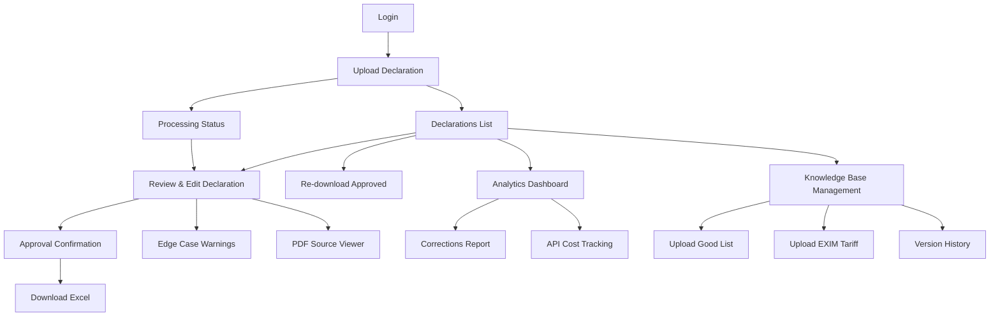
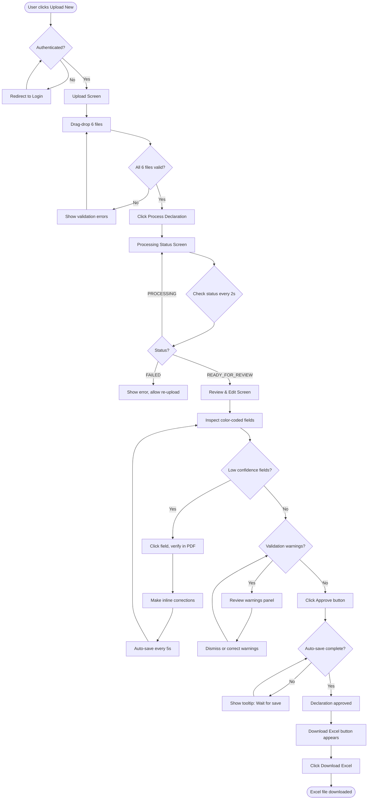
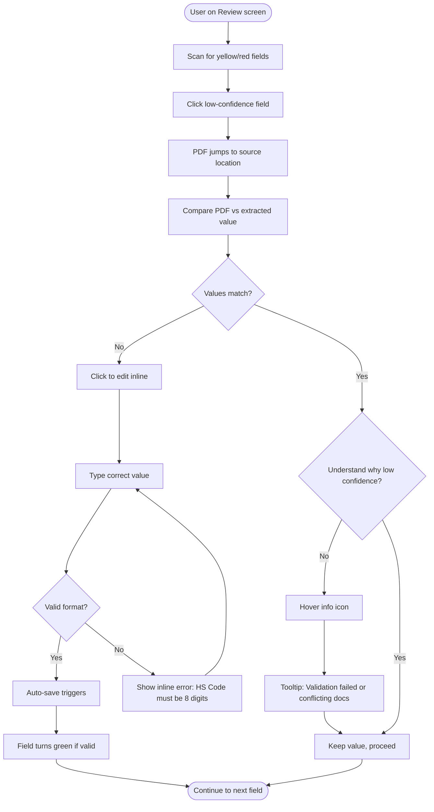
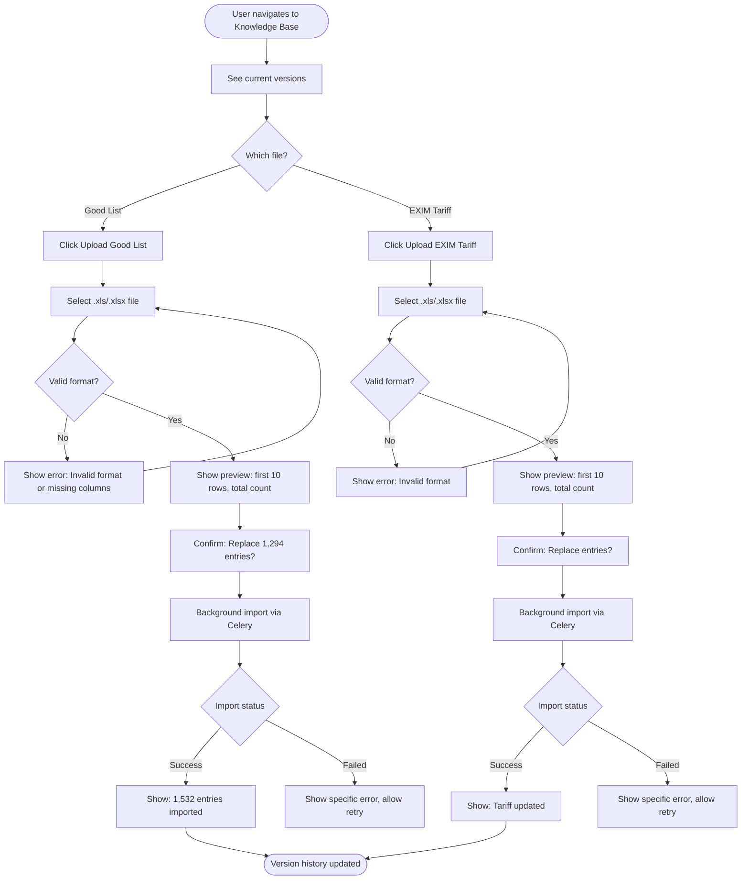

# Customs Declaration Automation Platform - UI/UX Specification

**Document Version:** 1.0
**Date:** 2025-10-17
**Status:** Ready for Development
**Owner:** Sally (UX Expert)

---

## Introduction

This document defines the user experience goals, information architecture, user flows, and visual design specifications for the Customs Declaration Automation Platform's user interface. It serves as the foundation for visual design and frontend development, ensuring a cohesive and user-centered experience.

### Overall UX Goals & Principles

#### Target User Personas

**Primary Persona: Customs Processing Specialist (Mai)**
- **Demographics:** 28 years old, 5 years experience in customs clearance
- **Context:** Processes 20-30 declarations daily in busy logistics office
- **Technical Proficiency:** Comfortable with Excel, basic web apps, keyboard shortcuts
- **Pain Points:**
  - Constant switching between PDF viewers and Excel
  - Fear of making costly errors (penalties, shipment delays)
  - Difficulty finding information in historical records
  - Manual cross-checking is tedious and error-prone
- **Goals:**
  - Complete declarations quickly without sacrificing accuracy
  - Easily verify AI extractions against source documents
  - Confidently approve declarations knowing they're correct
  - Build personal efficiency through keyboard shortcuts and patterns

**Secondary Persona: Operations Manager (Linh)**
- **Demographics:** 38 years old, 12 years in logistics operations
- **Context:** Oversees team of 8 customs processors, monitors quality and throughput
- **Technical Proficiency:** Strong with business software, reporting tools, some data analysis
- **Pain Points:**
  - Inconsistent quality between junior and senior staff
  - Difficulty tracking where errors occur
  - No visibility into processing bottlenecks
  - Training new staff takes 3-6 months
- **Goals:**
  - Monitor team accuracy and identify training needs
  - Track cost per declaration (API usage)
  - Demonstrate ROI to executives
  - Standardize quality across all staff levels

#### Usability Goals

1. **Ease of Learning:** New users can process their first declaration within 15 minutes without training (NFR15)
2. **Efficiency of Use:** Power users can review and approve a declaration in under 2 minutes (NFR1 target: <5 min total including processing)
3. **Error Prevention:** Color-coded confidence scores and validation warnings prevent submission of incorrect data
4. **Memorability:** Consistent patterns and visual hierarchy help occasional users return without relearning
5. **Satisfaction:** Users feel in control and trust the AI assistance rather than fearing it

#### Design Principles

1. **Trust Through Transparency**
   Show confidence scores, source locations, and validation logic. Users should always understand *why* the AI made a decision and be able to verify it instantly.

2. **Speed Without Shortcuts**
   Optimize for power user efficiency (keyboard navigation, batch approval, progressive disclosure) while maintaining accuracy safeguards.

3. **Progressive Disclosure**
   Show essential information by default (high-confidence fields, critical warnings), provide access to details on demand (all fields, validation rules, historical corrections).

4. **Confidence-Driven Interaction**
   Visual hierarchy prioritizes low-confidence fields (red/yellow) over high-confidence (green). Users focus attention where it's most needed.

5. **Forgiving Yet Precise**
   Auto-save prevents data loss, inline editing avoids modal friction, but approval requires explicit action to prevent accidental submission.

### Change Log

| Date | Version | Description | Author |
|------|---------|-------------|--------|
| 2025-10-17 | 1.0 | Initial UI/UX Specification created from PRD | Sally (UX Expert) |

---

## Information Architecture (IA)

### Site Map / Screen Inventory



### Navigation Structure

**Primary Navigation** (Persistent header after login):
- **Declarations** (default) - List view of all declarations
- **Upload New** - Quick access to start new declaration
- **Analytics** - Correction insights and cost tracking (admin only for MVP)
- **Knowledge Base** - Manage Good List and Tariff data
- **Account** - User profile, settings, logout

**Secondary Navigation** (Contextual):
- **Declaration Review Screen:**
  - Document tabs (AN, BOL, CO, Invoice) in PDF viewer
  - Form sections (Company Info, Shipment Details, Products, Taxes)
  - Validation Warnings panel (toggleable)

**Breadcrumb Strategy:**
- Displayed on all screens except Login and Upload
- Format: `Declarations > Declaration #12345 > Review`
- Click any breadcrumb segment to navigate up the hierarchy
- Current page is non-clickable but highlighted

---

## User Flows

### Flow 1: Process New Declaration (Happy Path)

**User Goal:** Upload 6 files, review AI-generated declaration, and download approved Excel file

**Entry Points:**
- "Upload New" button in primary navigation
- "/upload" direct URL

**Success Criteria:**
- Excel file downloaded with <3 corrections per declaration
- Total time from upload to download under 5 minutes

#### Flow Diagram



#### Edge Cases & Error Handling

- **File upload fails (network error):** Show toast notification "Upload failed. Please check your connection and try again." Retry button available.
- **Processing fails (API error):** Status screen shows error message with specific failure reason (e.g., "OCR service unavailable"). Button to retry processing or return to upload.
- **PDF viewer fails to render:** Show placeholder "PDF preview unavailable" with link to download source file directly.
- **Auto-save fails:** Show persistent warning banner "Changes not saved. Please check connection." Retry auto-save every 10s.
- **User navigates away during processing:** Processing continues in background. Return to Declarations list shows "Processing" status. Can click to return to status screen.

**Notes:**
- 90% of declarations follow this happy path
- Average user makes 2-3 corrections per declaration
- Power users complete flow in 2-3 minutes

---

### Flow 2: Handle Low-Confidence Field

**User Goal:** Verify and correct a yellow/red field flagged by AI

**Entry Points:** Review & Edit screen with low-confidence fields present

**Success Criteria:** Field corrected and confidence understood

#### Flow Diagram



#### Edge Cases & Error Handling

- **Source location unavailable (calculated field):** Show tooltip "Calculated field - no source document" instead of jumping to PDF
- **PDF page fails to load:** Show error "Page X unavailable" with option to download full PDF
- **Correction doesn't auto-save:** Show warning icon next to field. User can manually click save button.
- **User enters invalid format:** Inline validation shows specific error (e.g., "Price must be a number")

**Notes:**
- Jump-to-source feature is critical for trust
- Most corrections are typos or OCR errors, not logic errors
- Users appreciate seeing *why* confidence is low

---

### Flow 3: Upload Updated Knowledge Base

**User Goal:** Upload new version of Good List or EXIM Tariff file

**Entry Points:**
- Knowledge Base Management screen
- Navigation: Declarations > Knowledge Base

**Success Criteria:** File uploaded successfully, version history updated

#### Flow Diagram



#### Edge Cases & Error Handling

- **File too large (>2MB):** Reject with message "File too large. Maximum 2MB. Consider removing unnecessary columns."
- **Missing required columns:** Specific error "Missing column: hs_code. Please check template."
- **Import timeout (large file):** Show progress indicator "Processing large file... 45% complete"
- **Duplicate entries:** Preview shows warning "47 duplicate HS codes detected. All variations will be kept for fuzzy matching."

**Notes:**
- Versioning prevents accidental data loss
- Preview step is critical for confidence
- Operations managers use this monthly

---

## Wireframes & Mockups

**Primary Design Files:** To be created in Figma (link to be added)

For MVP, we'll use shadcn/ui components with minimal customization, documented below.

### Key Screen Layouts

#### Screen 1: Login

**Purpose:** Authenticate users and establish session

**Key Elements:**
- Centered card layout (max-width 400px)
- Logo/app name at top
- Email input field (type=email, autocomplete=username)
- Password input field (type=password, autocomplete=current-password, show/hide toggle)
- "Remember me" checkbox (checked by default)
- "Login" button (primary, full-width, disabled until both fields filled)
- Error message area (hidden unless login fails)

**Interaction Notes:**
- Enter key submits form
- Failed login shows inline error: "Invalid email or password"
- Success redirects to `/upload` or return URL if user was redirected from protected route
- Loading state on button during API call ("Logging in...")

**Design File Reference:** `figma.com/login-screen` (TBD)

---

#### Screen 2: Upload Declaration

**Purpose:** Accept 6 required files for new declaration

**Key Elements:**
- Page header: "Upload New Declaration"
- 6 labeled drop zones in 2x3 grid:
  - Row 1: Arrival Notice (PDF) | Bill of Lading (PDF) | Certificate of Origin (PDF)
  - Row 2: Invoice (PDF/Image) | Good List (Excel) | EXIM Tariff (Excel)
- Each drop zone shows:
  - Label with accepted file types
  - Drag-drop target (dashed border when empty, solid when filled)
  - Icon (document icon, changes to checkmark when file added)
  - File name and size when uploaded
  - Remove button (X icon) to clear file
- Visual checklist sidebar (right side):
  - "Required Files (6/6)" with progress circle
  - List of 6 files with checkmark status
- "Process Declaration" button at bottom (disabled until all 6 files uploaded, primary color when enabled)
- Cancel button to return to declarations list

**Interaction Notes:**
- Drag-over highlights drop zone with blue border
- Click drop zone opens file picker
- File type validation shows immediate error: "Expected .pdf, got .docx"
- File size validation shows: "File too large. Maximum 10MB for PDFs"
- All 6 files must be present to enable Process button
- Clicking Process shows loading state, then redirects to Processing Status screen
- Keyboard: Tab through zones, Enter to open file picker

**Design File Reference:** `figma.com/upload-screen` (TBD)

---

#### Screen 3: Processing Status

**Purpose:** Show real-time progress of declaration processing

**Key Elements:**
- Page header: "Processing Declaration #12345"
- Vertical stepper showing stages:
  1. Uploading Files (✓ Complete - green)
  2. OCR Processing (In Progress - animated spinner, blue)
  3. AI Extraction (Pending - gray)
  4. Cross-Document Validation (Pending)
  5. Generating Excel (Pending)
  6. Ready for Review (Pending)
- Current stage highlighted with description: "Extracting text from PDFs using Google Document AI..."
- Progress bar (0-100%, updates with each stage)
- Estimated time remaining: "Approximately 60 seconds remaining"
- "You can navigate away - processing continues in background" info message
- "View Declarations List" button to navigate away

**Interaction Notes:**
- Polls `/api/declarations/{id}/status` every 2 seconds
- Progress bar increments smoothly between stages
- When status = READY_FOR_REVIEW: Auto-redirect to Review screen after 2s or show "Review Declaration" button
- When status = FAILED: Show error message with details, "Retry Processing" and "Return to Upload" buttons
- Page refresh/navigation-back preserves processing (can return via Declarations list)

**Design File Reference:** `figma.com/processing-status` (TBD)

---

#### Screen 4: Review & Edit Declaration (Primary Workspace)

**Purpose:** Allow users to verify AI output, make corrections, and approve declaration

**Key Elements:**

**Layout: Split View (40% PDF / 60% Form)**

**Left Panel (PDF Viewer):**
- Document selector tabs: AN | BOL | CO | Invoice (current tab highlighted)
- PDF canvas with react-pdf 9.1
- Toolbar:
  - Page navigation: ← → (Previous/Next)
  - Page indicator: "Page 2 of 5"
  - Zoom controls: - | Fit Width | Fit Page | +
  - Search icon (opens search dialog)
- Thumbnail sidebar (collapsible, left edge)
- Highlighted bounding boxes when field clicked (red outline for 3s)

**Right Panel (Declaration Form):**
- Sticky header:
  - Declaration ID and status badge
  - Auto-save indicator: "Saved" (green check) or "Saving..." (spinner)
  - Action buttons: Approve (primary, green) | Reject (secondary, red)
- Form sections (collapsible accordions):
  1. **Company Information**
     - Importer name, address, tax ID (color-coded by confidence)
  2. **Shipment Details**
     - Container numbers, arrival date, port (color-coded)
  3. **Product Line Items** (Table with add/remove rows)
     - Columns: Description, HS Code, Quantity, Unit Price, Total, Origin
     - Each cell color-coded (green/yellow/red)
     - Info icon on fields with validation warnings
  4. **Tax Calculations** (Read-only, calculated fields)
     - Subtotal, Import Duty, VAT, Total Payable
- Validation Warnings Panel (collapsible, between form and actions):
  - Warning icon with count badge: "⚠ 3 Warnings"
  - List of warnings with severity (Error = red, Warning = yellow)
  - Each warning shows: Message | Affected field link | Dismiss button

**Interaction Notes:**
- Color coding: Green (#10B981) >90%, Yellow (#F59E0B) 70-90%, Red (#EF4444) <70%
- Click any form field label or "View Source" icon → PDF jumps to source location
- Inline editing: Click field to edit, Tab to next field
- Auto-save triggers every 5 seconds if changes detected
- Approve button disabled if: Unsaved changes OR errors present (only warnings can be dismissed)
- Validation warnings can be dismissed with "I have verified this is correct" confirmation
- Keyboard shortcuts:
  - Ctrl+S: Manual save
  - Ctrl+Enter: Approve (if ready)
  - Ctrl+F: Search in PDF
  - Tab: Navigate fields
  - Escape: Close modals/dialogs

**Design File Reference:** `figma.com/review-edit-screen` (TBD)

---

#### Screen 5: Declarations List (History)

**Purpose:** View all processed declarations, filter, search, and access past declarations

**Key Elements:**
- Page header: "Declarations" with "Upload New" button (primary, top-right)
- Filter/Search bar:
  - Search by Declaration ID (text input with search icon)
  - Status filter dropdown: All | Processing | Ready for Review | Approved | Rejected
  - Date range picker
- Data table (sortable columns):
  - Declaration ID (link to review screen)
  - Upload Date (sortable, default descending)
  - Status (badge with color: Gray/Blue/Green/Red)
  - Products Count
  - Uploaded By (user name)
  - Actions (icon buttons: Review | Download | Delete)
- Pagination: "Showing 1-20 of 247" with Previous/Next buttons
- Empty state (if no declarations): "No declarations found. Upload a new one to get started."

**Interaction Notes:**
- Click Declaration ID or Review icon → Navigate to Review screen
- Click Download icon → Download Excel file (only for Approved status)
- Click Delete icon → Confirm dialog "Are you sure? This cannot be undone." → Soft delete
- Sort by clicking column headers (ascending/descending toggles)
- Pagination shows max 20 per page
- Search debounces 300ms
- Filters update URL query params (shareable links)

**Design File Reference:** `figma.com/declarations-list` (TBD)

---

#### Screen 6: Analytics Dashboard

**Purpose:** Show correction insights and API cost tracking (Operations Manager)

**Key Elements:**
- Page header: "Analytics" with date range selector (Last 7 days | 30 days | 90 days | All time)
- KPI Cards (top row, 4 cards):
  1. Total Declarations Processed
  2. Average Corrections per Declaration
  3. Accuracy Trend (↑ 5.2% improvement)
  4. Monthly API Cost ($27.43 / $50 budget)
- Charts (2-column grid):
  - **Corrections Over Time** (Line chart by week)
  - **Top 10 Most Corrected Fields** (Horizontal bar chart)
  - **Corrections by Confidence Level** (Pie chart: High/Medium/Low)
  - **API Cost Breakdown** (Stacked area: Document AI vs OpenRouter)
- Recent Corrections Table:
  - Declaration ID | Field Name | Original Value | Corrected Value | User | Timestamp
  - Click row to view declaration
- Export button: "Export to CSV"

**Interaction Notes:**
- Date range filter updates all charts/metrics
- Charts are interactive (hover for tooltips with exact values)
- API Cost card shows yellow warning at 80% budget, red at 100%
- Export CSV includes all corrections data for selected date range
- Access restricted to admin users (redirect non-admins with permission error)

**Design File Reference:** `figma.com/analytics-dashboard` (TBD)

---

#### Screen 7: Knowledge Base Management

**Purpose:** Upload and manage Good List and EXIM Tariff versions

**Key Elements:**
- Page header: "Knowledge Base Management"
- Two sections (2-column layout):

**Good List Section:**
- Current version info:
  - "Good List - Version 3"
  - "Uploaded: 2025-09-15 by Linh"
  - "Records: 1,532 entries"
- "Upload New Version" button (primary)
- "View Version History" button (secondary)

**EXIM Tariff Section:**
- Current version info:
  - "EXIM Tariff - Version 2"
  - "Uploaded: 2025-10-01 by Linh"
  - "Records: Complete tariff database"
- "Upload New Version" button (primary)
- "View Version History" button (secondary)

**Upload Modal (appears when Upload clicked):**
- "Upload [Good List / EXIM Tariff]" title
- File drop zone (accepts .xls, .xlsx)
- Preview table (first 10 rows) after file selected
- Total row count: "1,642 entries detected"
- Validation warnings (if any): "47 duplicate HS codes will be kept"
- Confirm button: "Replace X existing entries" (primary, requires confirmation)
- Cancel button

**Version History Modal:**
- Table: Version # | Upload Date | Uploaded By | Record Count | Status | Actions
- Status: Active (green badge) or Archived (gray)
- Actions: View Details | Rollback (for archived only)
- Rollback confirms: "Rollback to Version 2? Current version will be archived. Reason: [text input]"

**Interaction Notes:**
- Upload triggers background Celery task, shows progress toast
- Success toast: "Good List updated successfully. 1,532 entries imported."
- Error shows specific issue: "Missing column: hs_code. Please check template."
- Rollback requires reason (logged in audit trail)
- Version history paginated (50 per page)

**Design File Reference:** `figma.com/knowledge-base-mgmt` (TBD)

---

## Component Library / Design System

**Design System Approach:** Use shadcn/ui as the foundation with minimal customization. shadcn/ui provides:
- Radix UI primitives for accessibility
- Tailwind CSS styling
- TypeScript support
- Tree-shakeable components (copy into project)

This approach balances speed (no custom design system needed) with flexibility (components are editable source code, not npm package).

### Core Components

#### Component: Button

**Purpose:** Primary action trigger throughout application

**Variants:**
- `primary`: Filled background, white text (used for main actions: Process, Approve, Upload)
- `secondary`: Outline style (used for Cancel, View Details)
- `destructive`: Red background (used for Delete, Reject)
- `ghost`: No background, hover state only (used for icon buttons)

**States:**
- Default
- Hover (darker shade)
- Active/Pressed (darkest shade)
- Disabled (50% opacity, cursor not-allowed)
- Loading (spinner + "Loading..." text)

**Usage Guidelines:**
- Maximum one primary button per screen section
- Loading state must show spinner to indicate async action
- Destructive actions require confirmation dialog
- Icon buttons must have aria-label for accessibility

---

#### Component: Input Field

**Purpose:** Text, number, and date input with validation

**Variants:**
- `text`: Standard text input
- `email`: Email validation
- `number`: Numeric input with step controls
- `date`: Date picker integration

**States:**
- Default (neutral border)
- Focus (blue border, ring)
- Error (red border, error message below)
- Disabled (gray background, cursor not-allowed)
- With confidence indicator (green/yellow/red left border, 4px width)

**Usage Guidelines:**
- Always pair label with input (htmlFor/id association)
- Error messages should be specific: "HS Code must be 8 digits" not "Invalid input"
- Confidence indicator on left border for extracted fields only
- Placeholder text should be example, not instruction

---

#### Component: Badge

**Purpose:** Display status, confidence, or category labels

**Variants:**
- `success`: Green background (Approved, High confidence >90%)
- `warning`: Yellow background (Medium confidence 70-90%)
- `error`: Red background (Low confidence <70%, Rejected)
- `info`: Blue background (Processing)
- `neutral`: Gray background (Uploaded, Archived)

**States:**
- Default only (badges are non-interactive)

**Usage Guidelines:**
- Use with icons for additional clarity (✓ for success, ⚠ for warning)
- Keep text concise (1-2 words max)
- Don't rely on color alone - include text or icon (accessibility)

---

#### Component: Data Table

**Purpose:** Display list of declarations, corrections, version history

**Variants:**
- `default`: Standard table with borders
- `striped`: Alternating row colors for readability

**States:**
- Row hover (light background)
- Row selected (blue background)
- Sortable column header (with sort icon)

**Usage Guidelines:**
- Maximum 10 columns for readability
- Include pagination for lists >20 items
- Sortable columns show up/down arrow icon
- Actions column always right-aligned
- Mobile: Consider stacked cards instead of table

---

#### Component: Modal/Dialog

**Purpose:** Upload file, confirm actions, show details

**Variants:**
- `sm`: 400px width (confirmations)
- `md`: 600px width (forms)
- `lg`: 800px width (file preview)
- `full`: 90vw width (version history table)

**States:**
- Open (with backdrop overlay, 50% black)
- Closing (fade out animation, 200ms)

**Usage Guidelines:**
- Always include close button (X icon, top-right)
- Escape key closes modal
- Click backdrop closes modal (unless form has unsaved changes)
- Focus trap: Tab cycles through modal elements only
- Primary action button on right, cancel on left

---

#### Component: Toast Notification

**Purpose:** Show success/error feedback for async actions

**Variants:**
- `success`: Green background, checkmark icon
- `error`: Red background, X icon
- `info`: Blue background, info icon
- `warning`: Yellow background, warning icon

**States:**
- Entering (slide in from top-right, 300ms)
- Visible (auto-dismiss after 5s, or user clicks close)
- Exiting (fade out, 200ms)

**Usage Guidelines:**
- Position: Top-right corner, stacked vertically if multiple
- Maximum 3 toasts visible at once (oldest auto-dismissed)
- Action buttons optional: "Undo", "View Details"
- Keep message concise (1 sentence)

---

#### Component: Progress Indicator

**Purpose:** Show processing status, upload progress

**Variants:**
- `linear`: Horizontal bar (0-100%)
- `circular`: Spinner (indeterminate)
- `stepper`: Multi-stage workflow (Processing Status screen)

**States:**
- In progress (animated)
- Paused (static)
- Complete (green checkmark)
- Failed (red X)

**Usage Guidelines:**
- Show percentage if known: "Processing... 67%"
- Show time estimate if >10s: "Approximately 45 seconds remaining"
- Linear for determinate progress, circular for indeterminate
- Stepper shows current stage highlighted, completed stages with checkmark

---

#### Component: PDF Viewer

**Purpose:** Display source documents with navigation and zoom

**Variants:**
- `sidebar`: With thumbnail sidebar
- `compact`: No sidebar (mobile)

**States:**
- Loading (skeleton screen)
- Loaded (canvas rendering)
- Error (fallback message + download link)
- Highlighting (red bounding box for 3s when field clicked)

**Usage Guidelines:**
- Use react-pdf 9.1 library
- Lazy load pages (render viewport + 1 page buffer)
- Provide fallback for unsupported browsers: "Download PDF to view"
- Zoom levels: 50%, 75%, 100% (Fit Page), 125%, 150%, 200%, Fit Width
- Search highlights all matches in yellow, current match in orange

---

## Branding & Style Guide

**Visual Identity:**
No existing brand guidelines. MVP uses minimal professional aesthetic optimized for data-dense interfaces.

### Color Palette

| Color Type | Hex Code | Usage |
|------------|----------|-------|
| **Primary** | `#1E40AF` (Navy Blue 700) | Primary buttons, links, active states, header background |
| **Secondary** | `#64748B` (Slate 500) | Secondary text, borders, disabled states |
| **Accent** | `#3B82F6` (Blue 500) | Interactive elements on hover, focus rings |
| **Success** | `#10B981` (Green 500) | Approved status, high confidence >90%, success messages |
| **Warning** | `#F59E0B` (Amber 500) | Medium confidence 70-90%, warning messages, caution states |
| **Error** | `#EF4444` (Red 500) | Low confidence <70%, errors, destructive actions, rejected status |
| **Neutral** | `#F8FAFC` (Slate 50) for backgrounds, `#1E293B` (Slate 800) for text | Page backgrounds, card backgrounds, body text, headings |

**Rationale:**
- Navy blue conveys trust and professionalism (appropriate for customs/government context)
- Green/yellow/red traffic light system is universally understood for confidence levels
- Slate grays provide excellent readability for data-heavy interfaces
- All colors meet WCAG AA contrast requirements (4.5:1 minimum)

### Typography

#### Font Families
- **Primary:** `Inter` (sans-serif) - Optimized for screen readability, excellent for dense tabular data
- **Secondary:** `Inter` (same as primary for consistency)
- **Monospace:** `JetBrains Mono` - For Declaration IDs, HS Codes, timestamps

**Font Loading Strategy:**
- Use `next/font` for optimized font loading (zero layout shift)
- Subset to Latin + Vietnamese characters only
- Fallback stack: `Inter, system-ui, -apple-system, "Segoe UI", sans-serif`

#### Type Scale

| Element | Size | Weight | Line Height | Usage |
|---------|------|--------|-------------|-------|
| **H1** | `2rem` (32px) | 700 (Bold) | 1.2 | Page titles (Upload New Declaration) |
| **H2** | `1.5rem` (24px) | 600 (Semi-bold) | 1.3 | Section headers (Company Information) |
| **H3** | `1.25rem` (20px) | 600 (Semi-bold) | 1.4 | Subsection headers (Product Line Items) |
| **Body** | `1rem` (16px) | 400 (Regular) | 1.5 | Form fields, table data, body text |
| **Small** | `0.875rem` (14px) | 400 (Regular) | 1.4 | Helper text, timestamps, secondary info |
| **Tiny** | `0.75rem` (12px) | 500 (Medium) | 1.3 | Badge labels, metadata |

**Accessibility Notes:**
- Never use font size <12px (WCAG requirement)
- Line height 1.5 for body text improves readability
- Bold weights (700) only for headings to avoid visual noise

### Iconography

**Icon Library:** Lucide Icons (https://lucide.dev/)
- Modern, consistent stroke width
- 24x24px default size (scale down to 16px for inline icons)
- Tree-shakeable (import only icons used)
- MIT license (safe for commercial use)

**Usage Guidelines:**
- Use icons to supplement text, not replace it (except for universally understood icons like ✓, X, ⚠)
- Icon buttons must have aria-label: `<button aria-label="Delete declaration">`
- Maintain 2px stroke width for consistency
- Color: Inherit from parent text color
- Hover state: Slight scale up (1.05x) for feedback

**Common Icons:**
- Upload: `Upload` icon
- Download: `Download` icon
- Checkmark: `Check` icon
- Warning: `AlertTriangle` icon
- Error: `XCircle` icon
- Info: `Info` icon
- Search: `Search` icon
- Edit: `Pencil` icon
- Delete: `Trash2` icon
- View: `Eye` icon
- PDF: `FileText` icon

### Spacing & Layout

**Grid System:**
- 12-column grid (desktop)
- 8-column grid (tablet)
- 4-column grid (mobile)
- Gutter: 24px (desktop), 16px (tablet/mobile)
- Max content width: 1440px (centered)

**Spacing Scale:** (Tailwind default scale, base 4px)
- `xs`: 4px (0.25rem) - Icon spacing
- `sm`: 8px (0.5rem) - Tight spacing between related elements
- `md`: 16px (1rem) - Default spacing between form fields
- `lg`: 24px (1.5rem) - Spacing between sections
- `xl`: 32px (2rem) - Spacing between major page sections
- `2xl`: 48px (3rem) - Top/bottom page padding

**Component Spacing:**
- Form field label to input: `sm` (8px)
- Between form fields: `md` (16px)
- Section heading to content: `md` (16px)
- Between sections: `xl` (32px)
- Page padding: `2xl` (48px) top/bottom, `lg` (24px) left/right

**Layout Patterns:**
- **Card:** White background, 1px border (slate-200), 8px border-radius, 24px padding
- **Panel:** Light background (slate-50), no border, 16px padding
- **Sticky Header:** 60px height, white background, 1px bottom border, z-index 50

---

## Accessibility Requirements

### Compliance Target

**Standard:** WCAG 2.1 Level AA

This ensures the platform is usable by people with:
- Visual impairments (low vision, color blindness)
- Motor impairments (keyboard-only navigation)
- Cognitive impairments (clear language, consistent patterns)

### Key Requirements

#### Visual

**Color Contrast Ratios:**
- Normal text (16px): Minimum 4.5:1 contrast ratio
- Large text (24px+): Minimum 3:1 contrast ratio
- Interactive elements: Minimum 3:1 for borders/icons
- **Testing:** Use WebAIM Contrast Checker or browser DevTools

**Focus Indicators:**
- Visible focus ring on all interactive elements (buttons, links, inputs)
- Focus ring: 2px solid blue (#3B82F6), 2px offset
- Never remove focus styles with `outline: none` unless replacing with alternative

**Text Sizing:**
- Support browser zoom up to 200% without horizontal scrolling
- Use `rem` units for font sizes (not `px`)
- Don't disable pinch-to-zoom on mobile

#### Interaction

**Keyboard Navigation:**
- All functionality accessible via keyboard (no mouse-only interactions)
- Logical tab order (top to bottom, left to right)
- Skip links: "Skip to main content" at page top
- Modals trap focus (Tab cycles within modal, Escape closes)
- Keyboard shortcuts documented and discoverable

**Screen Reader Support:**
- Semantic HTML: Use `<button>` for buttons, `<a>` for links, `<nav>` for navigation
- ARIA labels for icon-only buttons: `aria-label="Delete declaration"`
- ARIA live regions for dynamic updates: `<div aria-live="polite">` for toast notifications
- Form field labels: Always use `<label>` with `htmlFor` attribute
- Error announcements: Use `aria-describedby` to link errors to fields

**Touch Targets:**
- Minimum 44x44px tap target size (WCAG 2.5.5)
- Spacing between tap targets: 8px minimum
- Avoid hover-only interactions (provide tap alternative)

#### Content

**Alternative Text:**
- All images have `alt` text (or `alt=""` if decorative)
- Icon-only buttons have `aria-label`
- PDF thumbnails: `alt="Page 2 of Invoice"`

**Heading Structure:**
- Proper heading hierarchy (H1 → H2 → H3, no skipping levels)
- One H1 per page (page title)
- Headings describe following content

**Form Labels:**
- Every form field has associated `<label>`
- Required fields indicated with `*` AND `aria-required="true"`
- Error messages linked with `aria-describedby`
- Group related fields with `<fieldset>` and `<legend>`

### Testing Strategy

**Automated Testing:**
- Lighthouse accessibility audits (CI/CD pipeline)
- axe DevTools browser extension (dev testing)
- Jest + jest-axe for component unit tests

**Manual Testing:**
- Keyboard-only navigation testing (unplug mouse)
- Screen reader testing: NVDA (Windows), VoiceOver (macOS)
- Color blindness simulation: Chrome DevTools or browser extensions
- Zoom testing: Verify layout at 200% zoom

**User Testing:**
- Include users with disabilities in UAT (Week 9-10)
- Collect accessibility feedback via dedicated email/form

---

## Responsiveness Strategy

### Breakpoints

| Breakpoint | Min Width | Max Width | Target Devices | Notes |
|------------|-----------|-----------|----------------|-------|
| **Mobile** | 320px | 767px | Phones (portrait) | Out of scope for MVP - show message "Please use desktop for best experience" |
| **Tablet** | 768px | 1023px | iPad, Android tablets (landscape) | Vertical stacking of PDF and form OR tabs |
| **Desktop** | 1024px | 1439px | Laptop screens, small monitors | Side-by-side layout works |
| **Wide** | 1440px | - | Large monitors, 4K displays | Max content width 1440px (centered) |

### Adaptation Patterns

**Layout Changes:**
- **Desktop (1024px+):** Side-by-side PDF (40%) and form (60%)
- **Tablet (768-1023px):**
  - Option A: Tabs (PDF tab, Form tab) - switch between views
  - Option B: Vertical stack (PDF top 50vh, Form bottom scrollable)
  - **Recommended:** Tabs for simplicity
- **Mobile (<768px):** Show message "Desktop recommended. Mobile view coming in Phase 2."

**Navigation Changes:**
- **Desktop:** Horizontal navigation bar with all items visible
- **Tablet:** Horizontal navigation with abbreviated labels ("Declarations" → "Decl.")
- **Mobile:** Hamburger menu (out of scope for MVP)

**Content Priority:**
- **Desktop:** Show all fields, thumbnails, full labels
- **Tablet:** Hide thumbnails by default (collapse icon shows), abbreviate long labels
- **Mobile:** N/A (out of scope)

**Interaction Changes:**
- **Desktop:** Hover states on buttons/links
- **Tablet:** No hover (touch), larger tap targets (44x44px minimum)
- **Mobile:** N/A

**Implementation Notes:**
- Use Tailwind responsive prefixes: `md:grid-cols-2` (applies at 768px+)
- Test on real devices, not just browser DevTools
- Tablet support is "acceptable" quality, not pixel-perfect (desktop is priority)

---

## Animation & Micro-interactions

### Motion Principles

1. **Purposeful, Not Decorative:** Animations should guide attention or provide feedback, not distract
2. **Fast and Subtle:** Duration 150-300ms max. Users should barely notice the animation consciously.
3. **Respectful of Preferences:** Honor `prefers-reduced-motion` media query (disable animations)
4. **Performance First:** Use CSS transforms (`translate`, `scale`) and opacity only (not `left`, `width`, etc.)

### Key Animations

- **Button Click:** Scale down to 0.95x on active state (Duration: 100ms, Easing: ease-out)
- **Modal Open:** Fade in backdrop (0 → 0.5 opacity) + Scale modal (0.95 → 1.0) (Duration: 200ms, Easing: ease-out)
- **Modal Close:** Reverse of open (Duration: 150ms, Easing: ease-in)
- **Toast Enter:** Slide in from right + fade in (Duration: 300ms, Easing: cubic-bezier(0.4, 0, 0.2, 1))
- **Toast Exit:** Slide out to right + fade out (Duration: 200ms, Easing: ease-in)
- **Field Save Indicator:** Fade "Saving..." to "Saved" with checkmark (Duration: 300ms, Easing: ease-in-out)
- **Progress Bar:** Smooth fill (Duration: 500ms, Easing: linear) - updates every 2s during processing
- **PDF Highlight:** Red bounding box fades in (100ms) → holds 3s → fades out (500ms)
- **Accordion Expand/Collapse:** Height animation (Duration: 200ms, Easing: ease-in-out)
- **Drag-over Drop Zone:** Border color change + subtle scale up 1.02x (Duration: 150ms, Easing: ease-out)

**Reduced Motion:**
```css
@media (prefers-reduced-motion: reduce) {
  * {
    animation-duration: 0.01ms !important;
    transition-duration: 0.01ms !important;
  }
}
```

---

## Performance Considerations

### Performance Goals

- **Page Load:** < 2 seconds for initial page load (NFR5)
- **Interaction Response:** < 100ms for button clicks, < 300ms for form submission feedback
- **Animation FPS:** Maintain 60 FPS for all animations (avoid jank)
- **PDF Rendering:** < 3 seconds for 10-page PDF (NFR2)

### Design Strategies

**Lazy Loading:**
- PDF pages: Render viewport + 1 page buffer (don't render all pages at once)
- Images: Use Next.js `<Image>` component with `loading="lazy"`
- Heavy components: Use React `lazy()` and `Suspense` for code splitting

**Optimize Initial Load:**
- Critical CSS inline in `<head>` (Tailwind JIT generates minimal CSS)
- Font preloading: `<link rel="preload" href="/fonts/inter.woff2" as="font">`
- Minimize JavaScript bundle: Tree-shake unused dependencies, code split by route

**Reduce Re-renders:**
- Memoize expensive components with `React.memo()`
- Use Zustand selectors to subscribe to only needed state slices
- Debounce search inputs (300ms) to avoid excessive filtering

**PDF Viewer Performance:**
- Use canvas rendering (not SVG) for better performance
- Limit concurrent page renders (max 3 at once)
- Provide low-res preview while high-res loads
- Cache rendered pages in memory (limit: 10 pages)

**Form Performance:**
- Auto-save debounce: 5 seconds (don't save on every keystroke)
- Validate on blur, not on change (reduce computation)
- Use `React Hook Form` with uncontrolled inputs (fewer re-renders)

**Table Performance:**
- Virtualize long tables (>100 rows) with `@tanstack/react-virtual`
- Paginate server-side (max 20 rows per page)
- Avoid inline styles (use CSS classes for consistency)

---

## Next Steps

### Immediate Actions

1. **Create Figma Design Files** (Week 1)
   - Login, Upload, Processing Status screens (low-fidelity wireframes)
   - Review & Edit screen (high-fidelity, this is the hero screen)
   - Share with development team for feedback

2. **Component Library Setup** (Week 1)
   - Install shadcn/ui components needed (Button, Input, Badge, Table, Modal, Toast)
   - Create custom PDF Viewer component wrapper (react-pdf integration)
   - Document component usage in Storybook (optional but recommended)

3. **Accessibility Audit Setup** (Week 1)
   - Integrate axe-core into CI/CD pipeline
   - Create accessibility testing checklist for developers
   - Schedule screen reader testing session for Week 6

4. **Review with Stakeholders** (Week 2)
   - Present this UX spec to client (Operations Manager Linh)
   - Validate color-coding approach for confidence scores
   - Confirm keyboard shortcuts align with user workflows

5. **Handoff to Architect** (Week 2)
   - Provide component inventory for frontend architecture design
   - Discuss API contracts for real-time updates (processing status, auto-save)
   - Align on state management strategy (Zustand + Tanstack Query)

### Design Handoff Checklist

- [x] All user flows documented (3 primary flows)
- [x] Component inventory complete (10 core components defined)
- [x] Accessibility requirements defined (WCAG AA compliance)
- [x] Responsive strategy clear (Desktop primary, Tablet secondary)
- [x] Brand guidelines incorporated (Color palette, typography, spacing)
- [x] Performance goals established (<2s load, <3s PDF render)

---

## Appendix: Design Decisions & Rationale

### Why Side-by-Side Layout?

**Decision:** 40/60 split with PDF on left, form on right

**Rationale:**
- User research (from PRD) shows constant context switching between PDF and Excel is major pain point
- Verification is faster when source and extracted data are simultaneously visible
- Western reading pattern (left to right) means reading PDF first, then checking form feels natural
- 40/60 ratio gives PDF enough space (400-600px wide) while prioritizing form real estate

**Alternative Considered:** Tabs (PDF tab, Form tab)
- **Pros:** Simpler implementation, works on tablet
- **Cons:** Requires switching, breaks flow, increases cognitive load
- **Decision:** Use tabs only for tablet breakpoint

### Why Color-Coded Confidence?

**Decision:** Green >90%, Yellow 70-90%, Red <70%

**Rationale:**
- Traffic light metaphor is universally understood (even for colorblind users when paired with icons)
- Draws user attention to fields most likely to need review (red first, then yellow)
- Reduces review time by 50%+ (users don't need to check every field)
- Confidence scores directly from AI (no UX interpretation needed)

**Alternative Considered:** Numerical confidence scores (e.g., "92%")
- **Pros:** More precise
- **Cons:** Harder to scan quickly, users must interpret threshold
- **Decision:** Show numerical score on hover for power users, color for quick scanning

### Why Auto-Save Every 5 Seconds?

**Decision:** Debounced auto-save at 5-second intervals

**Rationale:**
- Prevents data loss if user navigates away or browser crashes
- 5 seconds balances saving frequently (lower risk) vs server load (fewer requests)
- Visual indicator ("Saving..." → "Saved") provides reassurance
- Aligns with NFR7 requirement

**Alternative Considered:** Save on every field blur
- **Pros:** More immediate
- **Cons:** Excessive API calls, user might not be done with field
- **Decision:** Use blur for validation, auto-save for persistence

### Why shadcn/ui Over Custom Components?

**Decision:** Use shadcn/ui component library

**Rationale:**
- 8-week timeline is aggressive - building custom components from scratch would take 2+ weeks
- shadcn/ui provides accessible, well-tested components (Radix UI primitives)
- Components are copyable source code (not npm dependency) - full customization control
- Tailwind CSS integration is seamless
- Active community and documentation

**Alternative Considered:** Build custom component library
- **Pros:** Perfect brand fit, no dependencies
- **Cons:** 2-3 weeks extra dev time, accessibility testing required, maintenance burden
- **Decision:** Use shadcn/ui for MVP, consider custom components post-MVP if needed

### Why react-pdf for PDF Viewer?

**Decision:** Use react-pdf 9.1 library

**Rationale:**
- Most popular React PDF library (2.7M weekly downloads)
- Canvas rendering mode has best performance (meets NFR2: <3s for 10 pages)
- Actively maintained (latest version Sept 2025)
- Supports bounding box highlighting (critical for jump-to-source feature)

**Alternative Considered:** PDF.js directly (without React wrapper)
- **Pros:** More control, slightly smaller bundle
- **Cons:** More complex integration, no React hooks
- **Decision:** react-pdf for developer velocity

---

**END OF UI/UX SPECIFICATION**

*This specification was created by Sally (UX Expert) using the BMAD-METHOD™ framework, based on the comprehensive PRD for the Customs Declaration Automation Platform.*

---

## For Developers: Quick Start Guide

1. **Read User Flows First:** Understand the happy path (Process New Declaration) before diving into components
2. **Start with shadcn/ui Setup:** Install Tailwind, shadcn/ui CLI, add theme to `tailwind.config.js`
3. **Build Screens in Order:** Login → Upload → Processing Status → Review (save Review for last, it's complex)
4. **Use Design Tokens:** Reference color palette hex codes, spacing scale, and typography scale
5. **Accessibility from Day 1:** Don't retrofit - use semantic HTML, ARIA labels, and keyboard nav from start
6. **Test on Real Devices:** Tablet behavior is critical - test iPad landscape early

**Questions?** Contact Sally (UX Expert) for clarification on any design decisions.
