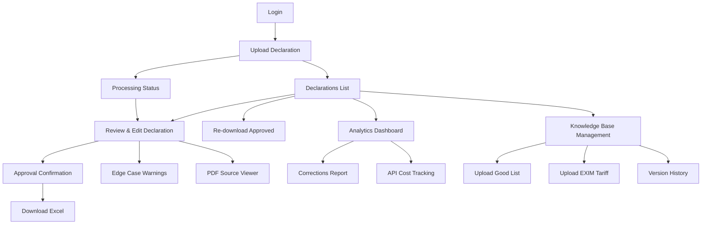

# Information Architecture (IA)

## Site Map / Screen Inventory

## Navigation Structure

**Primary Navigation** (Persistent header after login):
- **Declarations** (default) - List view of all declarations
- **Upload New** - Quick access to start new declaration
- **Analytics** - Correction insights and cost tracking (admin only for MVP)
- **Knowledge Base** - Manage Good List and Tariff data
- **Account** - User profile, settings, logout

**Secondary Navigation** (Contextual):
- **Declaration Review Screen:**
  - Document tabs (AN, BOL, CO, Invoice) in PDF viewer
  - Form sections (Company Info, Shipment Details, Products, Taxes)
  - Validation Warnings panel (toggleable)

**Breadcrumb Strategy:**
- Displayed on all screens except Login and Upload
- Format: `Declarations > Declaration #12345 > Review`
- Click any breadcrumb segment to navigate up the hierarchy
- Current page is non-clickable but highlighted

---
