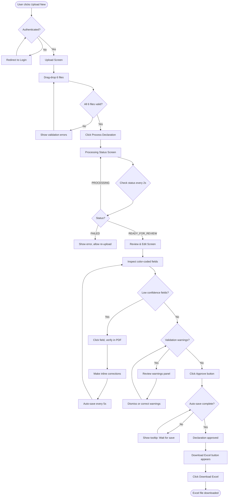
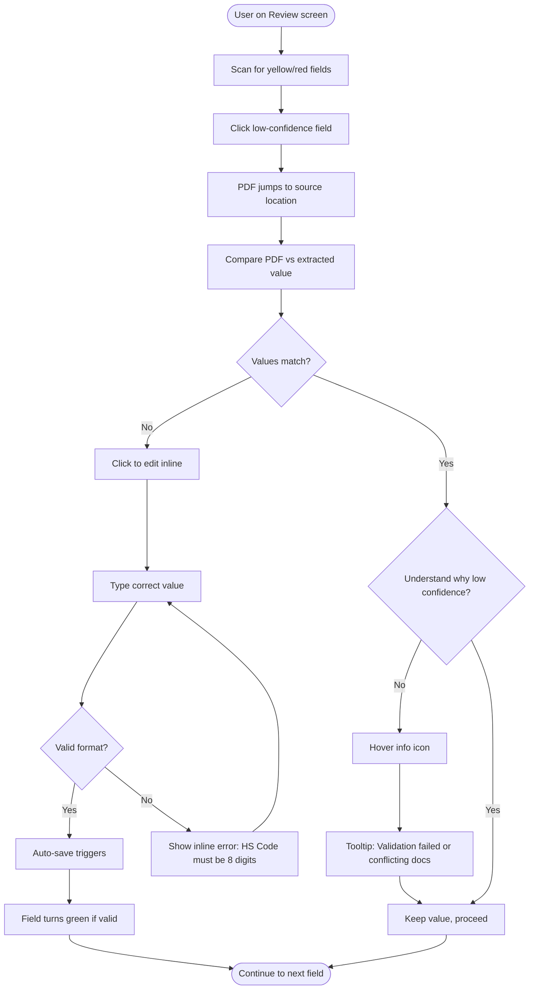
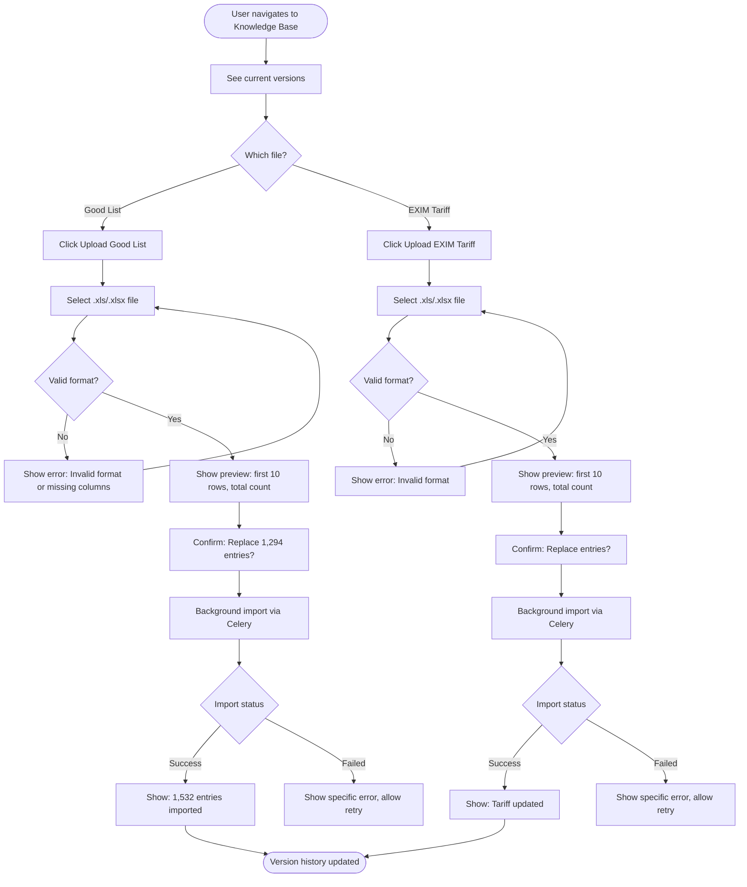

# User Flows

## Flow 1: Process New Declaration (Happy Path)

**User Goal:** Upload 6 files, review AI-generated declaration, and download approved Excel file

**Entry Points:**
- "Upload New" button in primary navigation
- "/upload" direct URL

**Success Criteria:**
- Excel file downloaded with <3 corrections per declaration
- Total time from upload to download under 5 minutes

### Flow Diagram

### Edge Cases & Error Handling

- **File upload fails (network error):** Show toast notification "Upload failed. Please check your connection and try again." Retry button available.
- **Processing fails (API error):** Status screen shows error message with specific failure reason (e.g., "OCR service unavailable"). Button to retry processing or return to upload.
- **PDF viewer fails to render:** Show placeholder "PDF preview unavailable" with link to download source file directly.
- **Auto-save fails:** Show persistent warning banner "Changes not saved. Please check connection." Retry auto-save every 10s.
- **User navigates away during processing:** Processing continues in background. Return to Declarations list shows "Processing" status. Can click to return to status screen.

**Notes:**
- 90% of declarations follow this happy path
- Average user makes 2-3 corrections per declaration
- Power users complete flow in 2-3 minutes

---

## Flow 2: Handle Low-Confidence Field

**User Goal:** Verify and correct a yellow/red field flagged by AI

**Entry Points:** Review & Edit screen with low-confidence fields present

**Success Criteria:** Field corrected and confidence understood

### Flow Diagram

### Edge Cases & Error Handling

- **Source location unavailable (calculated field):** Show tooltip "Calculated field - no source document" instead of jumping to PDF
- **PDF page fails to load:** Show error "Page X unavailable" with option to download full PDF
- **Correction doesn't auto-save:** Show warning icon next to field. User can manually click save button.
- **User enters invalid format:** Inline validation shows specific error (e.g., "Price must be a number")

**Notes:**
- Jump-to-source feature is critical for trust
- Most corrections are typos or OCR errors, not logic errors
- Users appreciate seeing *why* confidence is low

---

## Flow 3: Upload Updated Knowledge Base

**User Goal:** Upload new version of Good List or EXIM Tariff file

**Entry Points:**
- Knowledge Base Management screen
- Navigation: Declarations > Knowledge Base

**Success Criteria:** File uploaded successfully, version history updated

### Flow Diagram

### Edge Cases & Error Handling

- **File too large (>2MB):** Reject with message "File too large. Maximum 2MB. Consider removing unnecessary columns."
- **Missing required columns:** Specific error "Missing column: hs_code. Please check template."
- **Import timeout (large file):** Show progress indicator "Processing large file... 45% complete"
- **Duplicate entries:** Preview shows warning "47 duplicate HS codes detected. All variations will be kept for fuzzy matching."

**Notes:**
- Versioning prevents accidental data loss
- Preview step is critical for confidence
- Operations managers use this monthly

---
